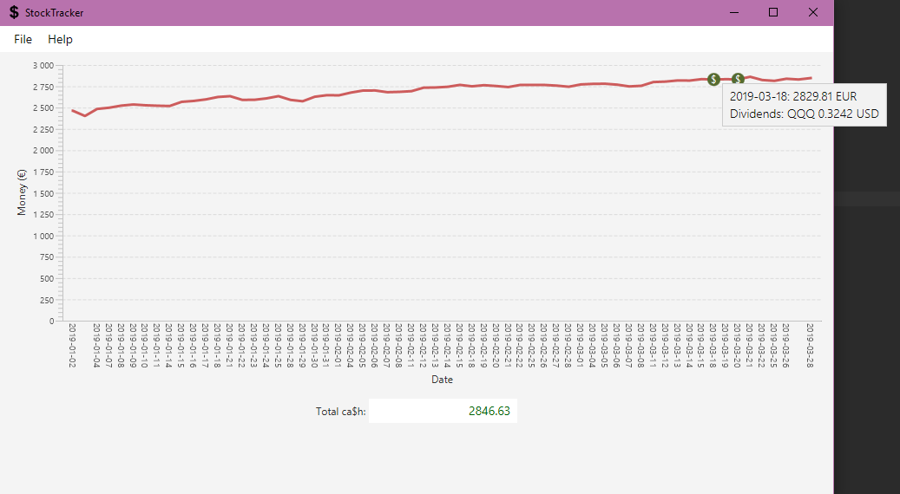

# StockTracker

Calls various APIs to get data on stock prices and currency rates, which it then uses to convert user input in the form of stock and amount owned to total value of portfolio in euros over time. The value of the portfolio is graphed using a JavaFX GUI.

## Getting Started

Download the .zip of the latest release and unpack it in a folder. Run StockTracker.exe.

For functional usage navigate to "Help -> Getting Started" from the menu bar of the application.

## Built With

* [Java 8](https://www.oracle.com/technetwork/java/javase/overview/java8-2100321.html) - The programming language used
* [Maven](https://maven.apache.org/) - Dependency Management, project building and deployment
* [Alpha Vantage API](https://www.alphavantage.co/) - API for fetching stock price data
* [Quotes API for Yahoo Finance](https://financequotes-api.com/) - API for fetching additional stock data
* [ECB SDMX 2.1 RESTful web service](https://sdw-wsrest.ecb.europa.eu/help/) - API for fetching currency data
* [JavaFX](https://openjfx.io/), [JUnit 5](https://junit.org/junit5/)

## Authors

* **Sten Arthur Laane** - [StenAL](https://github.com/StenAL)

## License

This project is licensed under the MIT License - see the [LICENSE](LICENSE) file for details
